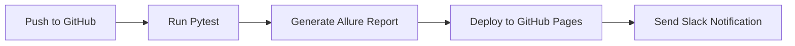

# QA Test Automation Portfolio

[한국어](./README.md) | **English**

[](https://github.com/yoplekiller/QATEST/actions)
[](https://www.python.org/downloads/)
[](https://www.selenium.dev/)
[](https://pytest.org/)

## 💡 Project Overview

Production-ready QA test automation portfolio built with Python and Selenium. Implements **Page Object Model (POM) pattern** to maximize reusability and maintainability.

Includes UI tests for the live Kurly e-commerce website and API tests using The Movie Database (TMDB) API.

### 🎯 **Key Features**
- ✅ **POM Pattern**: Industry-standard test architecture
- ✅ **Environment Variables**: Secure API key and credential management
- ✅ **CI/CD Automation**: Automated testing via GitHub Actions
- ✅ **Visual Reporting**: Detailed test results with Allure Report
- ✅ **Slack Integration**: Real-time test result notifications
- ✅ **Internationalization**: Korean/English documentation

## 🧰 Tech Stack

### Testing Framework
- **Python 3.11+**: Test automation language
- **Selenium 4.27**: Web UI automation
- **Pytest 8.3**: Test execution and management

### Reporting & Monitoring
- **Allure Report**: Visual test reports
- **Slack Bot**: Automated test result notifications
- **Excel Report**: Detailed test execution reports

### CI/CD & DevOps
- **GitHub Actions**: Automated test execution
- **GitHub Pages**: Allure Report deployment

### Architecture Patterns
- **Page Object Model (POM)**: Enhanced maintainability
- **Explicit Wait**: Stable test execution
- **Environment Variables**: Enhanced security

## 📖 Quick Start

### Prerequisites
- Python 3.11 or higher
- Chrome browser
- Git

### Installation & Execution

```bash
# 1. Clone repository
git clone https://github.com/yourusername/QATEST.git
cd QATEST

# 2. Create and activate virtual environment
python -m venv venv

# Windows
venv\Scripts\activate
# macOS/Linux
source venv/bin/activate

# 3. Install dependencies
pip install -r requirements.txt

# 4. Configure environment variables
cp .env.example .env
# Edit .env file with actual API keys and credentials
```

📖 **Detailed Setup Guide:** [SETUP.md](./SETUP.md)

### Environment Variable Configuration

Create `.env` file with the following content:

```bash
# TMDB API Key (Required)
TMDB_API_KEY=your_tmdb_api_key

# Test Account Credentials (Required)
KURLY_TEST_USERNAME=your_test_username
KURLY_TEST_PASSWORD=your_test_password

# Slack Webhook (Optional)
SLACK_WEBHOOK_URL=your_slack_webhook_url

# Test Environment
TEST_ENV=dev
```

### Running Tests

```bash
# Run all tests
pytest --alluredir=./allure-results

# Run specific test suite
pytest src/tests/api --alluredir=./allure-results  # API tests
pytest src/tests/ui --alluredir=./allure-results   # UI tests

# View Allure report
allure serve ./allure-results
```

## 📊 Test Results — Allure Report

📄 [View Live Allure Report](https://yoplekiller.github.io/QATEST/allure-report/main/index.html)


## 🔄 CI/CD Workflow (GitHub Actions)



## 🧪 Test Coverage

### 🛒 **Kurly UI Tests (26 tests)**

| Test Category | Validation | File |
|--------------|------------|------|
| **Login** | Valid/Invalid login, empty input handling | `test_ui_login.py` |
| **Product Search** | Normal search, empty search, special characters | `test_ui_search.py` |
| **Shopping Cart** | Cart access and verification | `test_ui_cart.py` |
| **Add to Cart** | Add to cart → quantity adjustment → cart | `test_ui_add_goods.py` |
| **E2E Flow** | Login → search → add → cart | `test_ui_goods_add_flow.py` |

### 🎬 **TMDB API Tests (20 tests)**

| Test Category | Validation | File |
|--------------|------------|------|
| **Movie Details** | Detail field validation | `test_movie_details.py` |
| **Popular Movies** | Status code and data count | `test_popular_movie.py` |
| **Movie Search** | Search functionality | `test_search_movie.py` |
| **SLA Testing** | Response time validation | `test_api_sla.py` |
| **Error Handling** | Invalid API key, error scenarios | `test_movie_invalid_api_key.py` |
| **Data Consistency** | Genre inclusion, release date consistency | `test_movie_genre_inclusion.py` |

## 🏗️ Project Structure

```
QATEST/
├── src/
│   ├── pages/              # Page Object Model
│   │   ├── base_page.py            # Base page class
│   │   ├── kurly_login_page.py     # Login page
│   │   ├── kurly_main_page.py      # Main page
│   │   ├── kurly_cart_page.py      # Cart page
│   │   └── kurly_goods_page.py     # Product details page
│   │
│   ├── config/             # Configuration files
│   │   └── config.yaml
│   │
│   ├── report/             # Report generation
│   │   └── generate_excel_report.py
│   │
│   └── tests/              # Test cases
│       ├── api/            # API tests (20 tests)
│       └── ui/             # UI tests (26 tests)
│
├── utils/                  # Utility functions (11 files)
│   ├── api_utils.py
│   ├── config_utils.py
│   ├── logger.py           # Logging system
│   ├── utilities.py
│   ├── data_loader.py
│   ├── csv_utils.py
│   ├── send_slack_result.py
│   ├── parse_test_result.py
│   ├── read_movie_data.py
│   └── read_product_data.py
│
├── .github/
│   └── workflows/
│       └── Test_Automation.yaml  # CI/CD configuration
│
├── .env.example            # Environment variable template
├── requirements.txt        # Python dependencies
├── pytest.ini             # Pytest configuration
├── README.md              # Korean documentation
├── README.en.md           # English documentation
└── SETUP.md               # Installation guide
```

## 🎯 Key Features

### ✅ **Implemented Features**

#### 1. **Page Object Model (POM) Pattern**
```python
# Reusable page objects
class KurlyLoginPage(BasePage):
    def login(self, username, password):
        self.enter_username(username)
        self.enter_password(password)
        self.click_login_button()

# Reused across multiple tests
def test_login_success():
    login_page.login("user", "pass")

def test_login_fail():
    login_page.login("wrong", "wrong")
```

#### 2. **Enhanced Security**
- API keys and credentials managed via environment variables
- Sensitive information protected with `.gitignore`
- `.env.example` template provided

#### 3. **Allure Report Integration**
```python
@allure.step("Login")
def login(self, username, password):
    """Step-by-step reporting"""
    self.enter_username(username)
    self.enter_password(password)
```

#### 4. **Logging System**
```python
from utils.logger import logger

logger.info("Test started")
logger.error("Error occurred", exc_info=True)
```

### 🔮 **Future Plans**

- [ ] OWASP ZAP security testing integration
- [ ] Docker environment optimization
- [ ] Auto-create issues on test failure (GitHub Issues/Jira)
- [ ] SQL-based database automation testing
- [ ] Performance testing (Locust/K6)
- [ ] Visual regression testing (Percy/Applitools)
- [ ] Cross-browser testing (Firefox, Safari)
- [ ] Playwright automation scripts (TypeScript)
- [ ] Appium mobile automation scripts

## 📹 Demo Videos

### 1. 🖥️ **Local Automation Execution**
[Watch Kurly Order Flow Automation Demo (YouTube)](https://www.youtube.com/watch?v=TqsvT2RsYEs)

## 🛡️ Security

- API keys and credentials stored in `.env` file (excluded from Git)
- `.env.example` provides template only
- All sensitive information managed via environment variables

**⚠️ Warning:** Never commit `.env` file to Git!

## 📚 Additional Documentation

- **[SETUP.md](./SETUP.md)**: Complete setup guide
- **[README.md](./README.md)**: Korean documentation

## 🤝 Contributing

While this is a portfolio project, suggestions for improvement and bug reports are welcome!

## 📄 License

This project is for portfolio purposes only.

## 📧 Contact

For questions or feedback about the project, please leave an issue.

---

**Made with ❤️ by QA Engineer**

*This project showcases QA automation skills and industry best practices.*
