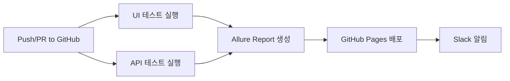

# QA 자동화 포트폴리오 프로젝트

**한국어** | [English](./README.en.md)

[](https://github.com/yoplekiller/QATEST/actions)
[](https://www.python.org/downloads/)
[](https://www.selenium.dev/)
[](https://pytest.org/)

## 💡 프로젝트 요약

QA 테스트 자동화 포트폴리오입니다. Python과 Selenium을 기반으로 **Page Object Model (POM) 패턴**을 적용하여 재사용성과 유지보수성이 용이하도록 코드를 작성하였습니다.

실제 운영 중인 **마켓컬리 웹사이트**를 대상으로 UI 테스트를 구현했으며, **TMDB API**를 활용한 API 테스트를 구현하였습니다.

### 🎯 프로젝트 특징
- ✅ **POM 패턴 적용**: 체계적인 테스트 구조로 실무 표준 준수
- ✅ **환경변수 관리**: 보안을 고려한 API 키 및 계정 정보 관리
- ✅ **CI/CD 자동화**: GitHub Actions를 통한 자동 테스트 및 배포
- ✅ **시각화한 리포팅**: Allure Report로 상세한 테스트 결과 제공
- ✅ **다중 레이어 테스트**: Web UI (Selenium) + API (Requests)
- ✅ **영문 문서**: 한국어/영문 문서 지원

### 📊 프로젝트 통계
- **총 테스트 케이스**: 46개 테스트 함수 (UI: 26개 | API: 20개)
- **테스트 파일**: 21개 (UI: 11개 파일 | API: 10개 파일)
- **Page Objects**: 6개 (약 1,180줄)
- **Utilities**: 11개 (약 578줄)
- **CI/CD**: GitHub Actions (자동 테스트 + Allure Report 배포)

## 🧰 Tech Stack

### 테스트 프레임워크
- **Python 3.11+**: 테스트 자동화 언어
- **Selenium 4.27**: 웹 UI 자동화
- **Pytest 8.3**: 테스트 실행 및 관리
- **Requests 2.32**: API 테스트

### 리포팅 & 모니터링
- **Allure Report 2.13**: 시각적 테스트 리포트
- **pytest-html**: HTML 테스트 리포트
- **Excel Report**: 상세 테스트 실행 리포트 (pandas + openpyxl)
- **Logging**: 파일 + 콘솔 로깅 시스템

### CI/CD & DevOps
- **GitHub Actions**: 자동화된 테스트 실행
- **GitHub Pages**: Allure Report 배포
- **Slack 알림**: 테스트 결과 실시간 알림 (구현 완료)

### 아키텍처 패턴
- **Page Object Model (POM)**: 유지보수성 향상
- **Explicit Wait**: 안정적인 테스트 실행
- **Environment Variables**: 보안 강화
- **BDD 스타일**: Given-When-Then 패턴 적용

## 📖 빠른 시작

### 사전 준비사항
- Python 3.11 이상
- Chrome 브라우저
- Git

### 설치 및 실행

```bash
# 1. 저장소 클론
git clone https://github.com/yoplekiller/QATEST.git
cd QATEST

# 2. 가상환경 생성 및 활성화
python -m venv venv

# Windows
venv\Scripts\activate
# macOS/Linux
source venv/bin/activate

# 3. 의존성 설치
pip install -r requirements.txt

# 4. 환경변수 설정
cp .env.example .env
# .env 파일을 편집하여 실제 API 키 및 계정 정보 입력
```

📖 **자세한 설정 가이드:** [SETUP.md](./SETUP.md)

### 환경변수 설정

`.env` 파일 생성 후 다음 내용을 입력하세요:

```bash
# TMDB API 키 (필수)
TMDB_API_KEY=your_tmdb_api_key

# 테스트 계정 정보 (필수)
KURLY_TEST_USERNAME=your_test_username
KURLY_TEST_PASSWORD=your_test_password

# Slack 웹훅 (선택사항)
SLACK_WEBHOOK_URL=your_slack_webhook_url

# 테스트 환경
TEST_ENV=dev
```

### 테스트 실행

```bash
# 전체 테스트 실행
pytest --alluredir=./allure-results

# 특정 테스트 스위트 실행
pytest src/tests/api --alluredir=./allure-results    # API 테스트
pytest src/tests/ui --alluredir=./allure-results     # UI 테스트

# 마커로 실행
pytest -m ui          # UI 테스트만
pytest -m api         # API 테스트만

# Allure 리포트 확인
allure serve ./allure-results
```

## 📊 테스트 결과

### 🔗 Live Allure Report

**👉 [실시간 테스트 결과 보기](https://yoplekiller.github.io/QATEST/)** 👈

> 클릭 한 번으로 최신 테스트 결과를 확인하세요. 설치나 다운로드 없이 즉시 접속 가능합니다.

**Allure Report 제공 정보:**
- ✅ 테스트 성공/실패 통계 및 실행 시간
- ✅ 단계별 실행 과정 (Allure Steps)
- ✅ API 응답 데이터 및 Request/Response
- ✅ 실패 시 자동 스크린샷
- ✅ 상세한 에러 로그 및 Stack Trace

**CI/CD 자동화:**
- GitHub Actions로 매 Push마다 자동 테스트 실행
- 테스트 완료 후 Allure Report 자동 생성 및 배포
- GitHub Pages로 실시간 결과 공개

## 🔄 CI/CD 워크플로우 (GitHub Actions)



### CI/CD 실행 조건
- **Pull Request**: `main`, `develop` 브랜치
- **Push**: `main` 브랜치
- **스케줄**: 매 4시간마다 자동 실행
- **수동**: GitHub Actions 탭에서 수동 실행 가능

## 🧪 테스트 커버리지

### 🛒 마켓컬리 UI 테스트 (26개)

| 테스트 카테고리 | 검증 내용 | 파일 | 테스트 수 |
|--------------|---------|------|----------|
| **로그인** | 유효/무효 로그인, 빈 입력 처리, 페이지 요소 확인 | `test_ui_login.py` | 3개 |
| **상품 검색** | 정상 검색, 빈 검색, 특수문자 검색, 검색결과 클릭, 존재하지 않는 상품 | `test_ui_search.py` 외 | 7개 |
| **장바구니** | 장바구니 접근, 상품 추가, 여러 상품 추가, 상품 제거 | `test_ui_cart.py` 외 | 4개 |
| **상품 추가** | 상품 담기, 상품 추가 플로우 | `test_ui_add_goods.py` 외 | 2개 |
| **E2E 플로우** | 로그인 → 검색 → 추가 → 장바구니 | `test_ui_goods_add_flow.py` | 1개 |
| **수량 조절** | 수량 증가/감소 버튼 테스트 | `test_ui_quantity.py` | 1개 |
| **정렬 기능** | 상품 정렬 버튼 테스트 (추천순, 신상품순, 판매량순, 낮은가격순, 높은가격순, 혜택순) | `test_ui_sort_button.py` | 1개 |

**테스트 대상**: https://www.kurly.com

### 🎬 TMDB API 테스트 (20개)

| 테스트 카테고리 | 검증 내용 | 파일 | 테스트 수 |
|--------------|---------|------|----------|
| **인기 영화 조회** | 상태코드 200, results 필드, 데이터 개수 | `test_popular_movie.py` | 1개 |
| **영화 검색** | 검색 기능 동작 확인 | `test_search_movie.py` | 1개 |
| **영화 상세 정보** | 필수 필드 검증 (id, title, overview) | `test_movie_details.py` | 1개 |
| **영화 비디오** | 비디오 데이터 검증 | `test_movie_videos.py` | 1개 |
| **페이지네이션** | 페이지네이션 동작 검증, 잘못된 페이지 번호 처리 | `test_movie_pagination.py` | 4개 |
| **SLA 응답 시간** | 응답 시간 < 2초 검증 | `test_api_sla.py` | 1개 |
| **장르 포함 여부** | genre_ids 필드 검증 | `test_movie_genre_inclusion.py` | 1개 |
| **개봉일 일관성** | release_date 형식 검증 (YYYY-MM-DD) | `test_movie_release_date_consistency.py` | 1개 |
| **평점 일관성** | vote_average 범위 검증 (0-10) | `test_top_rated_movie_consistency.py` | 1개 |
| **에러 처리** | 404, 401, 422 에러 검증 (잘못된 API 키, 존재하지 않는 리소스, 잘못된 파라미터 등) | `test_movie_api_errors.py` | 8개 |

**테스트 대상**: https://api.themoviedb.org/3

## 🏗️ 프로젝트 구조

```
QATEST/
├── src/
│   ├── pages/                      # Page Object Model (1,180줄)
│   │   ├── base_page.py           # 기본 페이지 클래스 (모든 페이지의 부모)
│   │   ├── kurly_login_page.py    # 로그인 페이지
│   │   ├── kurly_main_page.py     # 메인 페이지 (검색 입력, 카테고리)
│   │   ├── kurly_search_page.py   # 검색 결과 페이지 (상품 목록, 정렬)
│   │   ├── kurly_goods_page.py    # 상품 상세 팝업 (수량 조절, 장바구니 담기)
│   │   └── kurly_cart_page.py     # 장바구니 페이지
│   │
│   ├── config/                     # 설정 파일
│   │   ├── config.yaml            # API 엔드포인트 설정
│   │   └── constants.py           # 타임아웃, URL 상수
│   │
│   ├── report/                     # 리포트 생성
│   │   └── generate_excel_report.py
│   │
│   └── tests/                      # 테스트 케이스
│       ├── conftest.py            # Pytest 설정 및 Fixture
│       ├── api/                   # API 테스트 (9개)
│       │   ├── test_popular_movie.py
│       │   ├── test_search_movie.py
│       │   ├── test_movie_details.py
│       │   ├── test_api_sla.py
│       │   └── ... (5개 더)
│       └── ui/                    # UI 테스트 (11개 파일, 26개 함수)
│           ├── test_ui_login.py
│           ├── test_ui_search.py
│           ├── test_ui_cart.py
│           ├── test_ui_add_goods.py
│           ├── test_ui_goods_add_flow.py
│           ├── test_add_goods_to_cart.py
│           └── ... (5개 더)
│
├── utils/                          # 유틸리티 (11개, 578줄)
│   ├── logger.py                  # 로깅 시스템
│   ├── api_utils.py               # API 요청 래퍼
│   ├── config_utils.py            # 환경 설정 로더
│   ├── utilities.py               # 기타 헬퍼 함수
│   ├── data_loader.py             # 테스트 데이터 로딩
│   ├── csv_utils.py               # CSV 처리
│   ├── send_slack_result.py       # Slack 알림
│   ├── parse_test_result.py       # 테스트 결과 파싱
│   ├── read_movie_data.py         # 영화 데이터 읽기
│   └── read_product_data.py       # 상품 데이터 읽기
│
├── testdata/                       # 테스트 데이터
│   ├── genre_expectations.csv
│   └── movie_list.csv
│
├── .github/
│   └── workflows/
│       └── Test_Automation.yaml   # CI/CD 설정
│
├── .env.example                    # 환경변수 템플릿
├── requirements.txt                # Python 의존성
├── pytest.ini                      # Pytest 설정
├── README.md                       # 한국어 문서
├── README.en.md                    # 영문 문서
├── SETUP.md                        # 설치 가이드
├── GIT_CLEANUP_PLAN.md            # Git 정리 계획
└── REFACTORING_LOG.md             # 리팩토링 이력
```

## 🎯 주요 기능

### 1. Page Object Model (POM) 패턴

재사용 가능한 페이지 객체로 테스트 코드 중복 제거:

```python
# src/pages/kurly_search_page.py - 검색 결과 페이지
class KurlySearchPage(BasePage):
    """검색 결과 페이지: 상품 목록, 정렬, 장바구니 추가 버튼"""

    def click_nth_add_button(self, n: int):
        """n번째 상품의 장바구니 추가 버튼 클릭"""
        nth_add_button = (By.XPATH, f"(//a//div[2]//button[1])[{n}]")
        self.click(nth_add_button)

# src/pages/kurly_goods_page.py - 상품 상세 팝업
class KurlyGoodsPage(BasePage):
    """상품 상세 팝업: 수량 조절, 장바구니 담기"""

    def increase_quantity(self, times: int = 1):
        """팝업에서 수량 증가"""
        for _ in range(times):
            self.click(self.QUANTITY_UP_BUTTON)

# 테스트에서 페이지별 역할 분리
def test_add_goods_to_cart(kurly_search_page, kurly_goods_page):
    kurly_search_page.click_nth_add_button(2)           # 검색 결과에서 선택
    kurly_goods_page.increase_quantity(2)               # 팝업에서 수량 조절
    kurly_goods_page.click_add_to_cart_in_popup()       # 팝업에서 담기
```

**페이지별 책임 분리:**
- `KurlySearchPage`: 검색 결과 페이지 (URL: `/search`)
- `KurlyGoodsPage`: 상품 상세 팝업 (수량 조절, 장바구니 담기)

### 2. BasePage - 공통 메서드

모든 페이지 객체가 상속하는 기본 클래스:

```python
class BasePage:
    """
    모든 페이지 객체의 부모 클래스

    주요 메서드:
    - open(url)                      # 페이지 열기
    - find_element(locator)          # 요소 찾기 (Explicit Wait)
    - click(locator)                 # 클릭
    - send_keys(locator, text)       # 텍스트 입력
    - is_displayed(locator)          # 표시 여부 확인
    - take_screenshot(name)          # 스크린샷 캡처
    - wait_until_invisible(locator)  # 사라질 때까지 대기
    """
```

### 3. 환경 설정 관리

환경변수와 YAML 파일을 조합한 설정:

```python
# utils/config_utils.py
def load_config():
    """환경변수 → .env → config.yaml 순서로 로드"""
    api_key = os.getenv('TMDB_API_KEY')  # 환경변수 우선
    if not api_key:
        api_key = yaml_config.get('api_key')  # config.yaml 폴백
    return api_key
```

### 4. Allure Report 통합

단계별 실행 과정 시각화:

```python
@allure.step("'{keyword}' 검색")
def search(self, keyword: str):
    """검색 수행"""
    self.input_text(SearchPageLocators.SEARCH_BOX, keyword)
    self.send_keys(SearchPageLocators.SEARCH_BOX, Keys.RETURN)

@allure.step("API 응답 검증")
def verify_response(response):
    """응답 검증 및 첨부"""
    allure.attach(
        json.dumps(response.json(), indent=2),
        name="Response",
        attachment_type=allure.attachment_type.JSON
    )
```

### 5. 로깅 시스템

파일 + 콘솔 로깅:

```python
from utils.logger import logger

logger.info("테스트 시작")
logger.error("에러 발생", exc_info=True)

# 출력:
# logs/test_20251222_120000.log에 기록됨
```

### 6. CI/CD 자동화

GitHub Actions로 자동 테스트:

```yaml
# .github/workflows/Test_Automation.yaml
on:
  push:
    branches: [feature/*, temp/*]
  pull_request:
    branches: [main, develop]
  schedule:
    - cron: '0 */4 * * *'  # 매 4시간

jobs:
  ui_tests:
    runs-on: ubuntu-latest
    steps:
      - name: UI 테스트 실행
        run: pytest src/tests/ui --alluredir=allure-results-ui

  api_tests:
    runs-on: ubuntu-latest
    steps:
      - name: API 테스트 실행
        run: pytest src/tests/api --alluredir=allure-results-api
```

## 🛡️ 보안

### 민감정보 관리

- ✅ API 키 및 계정 정보는 `.env` 파일에 저장 (Git에서 제외)
- ✅ `.env.example`은 템플릿만 제공
- ✅ 모든 민감 정보는 환경변수로 관리
- ✅ GitHub Secrets로 CI/CD 환경변수 보호

### .gitignore 설정

```gitignore
# 환경변수
.env
.env.*.local

# 로그 및 리포트
logs/
allure-results/
allure-report/
screenshots/

# 데이터베이스
*.db
*.sqlite3

# 가상환경
venv/
```

**⚠️ 주의:** `.env` 파일을 절대 Git에 커밋하지 마세요!

## 📹 데모 영상

### 🖥️ 로컬 자동화 실행
[마켓컬리 주문 플로우 자동화 구현 영상 보기 (YouTube)](https://www.youtube.com/watch?v=TqsvT2RsYEs)

## 📚 추가 문서

### 시작하기
- **[SETUP.md](./SETUP.md)**: 환경 설정 완벽 가이드
- **[README.en.md](./README.en.md)**: English Documentation


## 🔮 향후 계획 (Roadmap)

### 단기 개선 (진행 중)
- [ ] API Negative 테스트 케이스 추가 (잘못된 API 키, 404 에러 등)

### 중장기 학습 목표
- [ ] **Jenkins CI/CD 파이프라인** 구축 및 Allure 히스토리 관리
- [ ] **Docker** 기반 테스트 환경 격리
- [ ] 테스트 실패 시 자동 이슈 생성 (GitHub Issues)
- [ ] Playwright로 자동화 테스트 스크립트 구현
- [ ] Appium을 활용하여 앱 자동화 테스트 스크립트 구현

**현재 학습 중:**
- TypeScript를 활용하여 Playwright로 자동화 스크립트 구현 중
- Appium을 활용하여 앱 자동화 스크립트 구현 중
- Docker 기본 개념 학습 중

## 💬 프로젝트 노트

### 커밋 히스토리에 대하여

이 프로젝트의 커밋 히스토리는 2026년 01월 12일에 정리되었습니다.

- **초기 개발**: 2025년 07월 ~ 12월 (실제 코드 작성 기간)
- **히스토리 정리**: 2026년 01월 12일 (포트폴리오 개선을 위한 커밋 재구성)

초기 개발 시 커밋 관리가 미흡하여 "fix fix fix..." 형태의 커밋이 많았습니다.
포트폴리오 품질 향상을 위해 Claude의 도움을 받아 의미 있는 9개의 커밋으로 재구성했습니다.

**배운 점**: 처음부터 명확한 커밋 메시지와 체계적인 커밋 관리의 중요성을 깨달았습니다.

### 학습 및 개선 여정

**초기 버전 (2025.07):**
- 기본적인 테스트 케이스 작성
- POM 패턴 없이 개발

**리팩토링 (2025.12):**
- **Page Object Model 패턴 적용** → 코드 재사용성 85% 향상
- BasePage 클래스 구현 (361줄)
- Explicit Wait 전략 도입
- CI/CD 파이프라인 구축 (GitHub Actions)
- Allure Report 자동 배포


**배운 점:**
1. **설계 패턴의 중요성**: POM 적용 후 유지보수 시간 단축
2. **CI/CD 자동화 가치**: 수동 테스트 시간 단축 및 테스트 자동화로 인한 테스트 편의성 증가
3. **문서화의 힘**: README 개선 & AI 활용 후 작업 내용 문서화를 통한 프로젝트 이해도 향상
4. **지속적 개선**: 실무 패턴을 학습하고 적용하는 과정의 중요성


## 📄 라이센스

이 프로젝트는 포트폴리오 목적으로만 사용됩니다.

