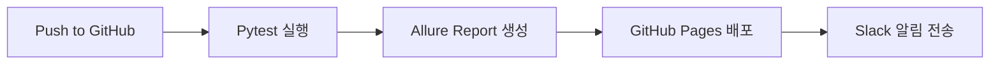

# QA 자동화 포트폴리오 프로젝트

**한국어** | [English](./README.en.md)

[](https://github.com/yoplekiller/QATEST/actions)
[](https://www.python.org/downloads/)
[](https://www.selenium.dev/)
[](https://pytest.org/)

## 💡 프로젝트 요약

QA 테스트 자동화 포트폴리오입니다. Python과 Selenium을 기반으로 **Page Object Model (POM) 패턴**을 적용하여 재사용성과 유지보수성을 극대화했습니다.

실제 운영 중인 마켓컬리 웹사이트를 대상으로 UI/Mobile 테스트를 구현했으며, TMDB API를 활용한 API 테스트도 포함되어 있습니다.

### 🎯 **프로젝트 특징**
- ✅ **POM 패턴 적용**: 체계적인 테스트 구조로 실무 표준 준수
- ✅ **환경변수 관리**: 보안을 고려한 API 키 및 계정 정보 관리
- ✅ **CI/CD 자동화**: GitHub Actions를 통한 자동 테스트 및 배포
- ✅ **시각적 리포팅**: Allure Report로 상세한 테스트 결과 제공
- ✅ **Slack 알림**: 테스트 결과 실시간 알림
- ✅ **국제화 문서**: 한국어/영문 문서 지원

## 🧰 Tech Stack

### 테스트 프레임워크
- **Python 3.11+**: 테스트 자동화 언어
- **Selenium 4.27**: 웹 UI 자동화
- **Pytest 8.3**: 테스트 실행 및 관리
- **Appium**: Android 모바일 테스트

### 리포팅 & 모니터링
- **Allure Report**: 시각적 테스트 리포트
- **Slack Bot**: 테스트 결과 자동 알림
- **Excel Report**: 상세 테스트 실행 리포트

### CI/CD & DevOps
- **GitHub Actions**: 자동화된 테스트 실행
- **GitHub Pages**: Allure Report 배포

### 아키텍처 패턴
- **Page Object Model (POM)**: 유지보수성 향상
- **Explicit Wait**: 안정적인 테스트 실행
- **Environment Variables**: 보안 강화

## 📖 빠른 시작

### 사전 준비사항
- Python 3.11 이상
- Chrome 브라우저
- Git

### 설치 및 실행

```bash
# 1. 저장소 클론
git clone https://github.com/yourusername/QATEST.git
cd QATEST

# 2. 가상환경 생성 및 활성화
python -m venv venv

# Windows
venv\Scripts\activate
# macOS/Linux
source venv/bin/activate

# 3. 의존성 설치
pip install -r requirements.txt

# 4. 환경변수 설정
cp .env.example .env
# .env 파일을 편집하여 실제 API 키 및 계정 정보 입력
```

📖 **자세한 설정 가이드:** [SETUP.md](./SETUP.md)

### 환경변수 설정

`.env` 파일 생성 후 다음 내용을 입력하세요:

```bash
# TMDB API 키 (필수)
TMDB_API_KEY=your_tmdb_api_key

# 테스트 계정 정보 (필수)
KURLY_TEST_USERNAME=your_test_username
KURLY_TEST_PASSWORD=your_test_password

# Slack 웹훅 (선택사항)
SLACK_WEBHOOK_URL=your_slack_webhook_url

# 테스트 환경
TEST_ENV=dev
```

### 테스트 실행

```bash
# 전체 테스트 실행
pytest --alluredir=./allure-results

# 특정 테스트 스위트 실행
pytest src/tests/api_tests --alluredir=./allure-results  # API 테스트
pytest src/tests/ui_tests --alluredir=./allure-results   # UI 테스트
pytest src/tests/mobile_tests --alluredir=./allure-results  # Mobile 테스트

# Allure 리포트 확인
allure serve ./allure-results
```

## 📊 테스트 결과 — Allure Report

📄 [Live Allure Report 보기](https://yoplekiller.github.io/QATEST/allure-report/main/index.html)


## 🔄 CI/CD 워크플로우 (GitHub Actions)



## 🧪 테스트 커버리지

### 🛒 **마켓컬리 UI 테스트 (10개)**

| 테스트 카테고리 | 검증 내용 | 파일 |
|--------------|---------|------|
| **로그인** | 유효/무효 로그인, 빈 입력 처리 | `test_ui_login.py` |
| **상품 검색** | 정상 검색, 빈 검색, 특수문자 검색 | `test_ui_search.py` |
| **장바구니** | 장바구니 접근 및 확인 | `test_ui_cart.py` |
| **상품 추가** | 상품 담기 → 수량 조절 → 장바구니 | `test_ui_add_product.py` |
| **E2E 플로우** | 로그인 → 검색 → 추가 → 장바구니 | `test_ui_product_add_flow.py` |

### 🎬 **TMDB API 테스트 (9개)**

| 테스트 카테고리 | 검증 내용 | 파일 |
|--------------|---------|------|
| **영화 상세** | 상세 정보 필드 검증 | `test_movie_details.py` |
| **인기 영화** | 응답 코드 및 데이터 개수 | `test_popular_movie.py` |
| **영화 검색** | 검색 기능 동작 확인 | `test_search_movie.py` |
| **SLA 테스트** | 응답 시간 검증 | `test_api_sla.py` |
| **에러 처리** | 잘못된 API 키, 에러 시나리오 | `test_movie_invalid_api_key.py` |
| **데이터 일관성** | 장르 포함 여부, 개봉일 일관성 | `test_movie_genre_inclusion.py` |

### 📱 **Mobile 테스트 (3개)**

| 테스트 카테고리 | 검증 내용 | 파일 |
|--------------|---------|------|
| **베스트 상품** | 베스트 메뉴 진입 | `test_best_product.py` |
| **저가 상품** | 저가 필터 기능 | `test_low_price.py` |
| **신상품** | 신상품 표시 기능 | `test_new_product.py` |

## 🏗️ 프로젝트 구조

```
QATEST/
├── src/
│   ├── pages/              # Page Object Model
│   │   ├── base_page.py            # 기본 페이지 클래스
│   │   ├── kurly_login_page.py     # 로그인 페이지
│   │   ├── kurly_main_page.py      # 메인 페이지
│   │   ├── kurly_cart_page.py      # 장바구니 페이지
│   │   └── kurly_product_page.py   # 상품 페이지
│   │
│   ├── config/             # 설정 파일
│   │   └── config.yaml
│   │
│   ├── report/             # 리포트 생성
│   │   └── generate_excel_report.py
│   │
│   └── tests/              # 테스트 케이스
│       ├── api_tests/      # API 테스트 (9개)
│       ├── ui_tests/       # UI 테스트 (10개)
│       └── mobile_tests/   # Mobile 테스트 (3개)
│
├── utils/                  # 유틸리티 함수
│   ├── api_utils.py
│   ├── config_utils.py
│   ├── logger.py           # 로깅 시스템
│   └── utilities.py
│
├── docs/                   # 문서
│   ├── POM_GUIDE.md                    # POM 가이드
│   ├── POM_STRUCTURE_EXAMPLE.md        # POM 구조 예시
│   └── PRODUCTION_READY_CHECKLIST.md   # 실무 준비도 체크리스트
│
├── .github/
│   └── workflows/
│       └── Test_Automation.yaml  # CI/CD 설정
│
├── .env.example            # 환경변수 템플릿
├── requirements.txt        # Python 의존성
├── pytest.ini             # Pytest 설정
├── README.md              # 한국어 문서
├── README.en.md           # 영문 문서
└── SETUP.md               # 설치 가이드
```

## 🎯 주요 기능

### ✅ **이미 구현된 기능**

#### 1. **Page Object Model (POM) 패턴**
```python
# 재사용 가능한 페이지 객체
class KurlyLoginPage(BasePage):
    def login(self, username, password):
        self.enter_username(username)
        self.enter_password(password)
        self.click_login_button()

# 여러 테스트에서 재사용
def test_login_success():
    login_page.login("user", "pass")

def test_login_fail():
    login_page.login("wrong", "wrong")
```

#### 2. **보안 강화**
- 환경변수로 API 키 및 계정 정보 관리
- `.gitignore`로 민감 정보 보호
- `.env.example` 템플릿 제공

#### 3. **Allure 리포트 통합**
```python
@allure.step("로그인")
def login(self, username, password):
    """단계별 리포팅"""
    self.enter_username(username)
    self.enter_password(password)
```

#### 4. **로깅 시스템**
```python
from utils.logger import logger

logger.info("테스트 시작")
logger.error("에러 발생", exc_info=True)
```

### 🔮 **향후 계획 (Roadmap)**

- [ ] OWASP ZAP 보안 테스트 통합
- [ ] API 테스트 케이스 확장 (Negative 케이스 추가)
- [ ] Docker 환경 최적화
- [ ] 테스트 실패 시 자동 이슈 생성 (GitHub Issues/Jira)
- [ ] 추가 Mobile 테스트 케이스
- [ ] SQL을 이용한 DB 자동화 테스트
- [ ] 성능 테스트 추가 (Locust/K6)
- [ ] Visual Regression 테스트

## 📹 데모 영상

### 1. 🖥️ **로컬 자동화 실행**
[마켓컬리 주문 플로우 자동화 구현 영상 보기 (YouTube)](https://www.youtube.com/watch?v=TqsvT2RsYEs)

## 🛡️ 보안

- API 키 및 계정 정보는 `.env` 파일에 저장 (Git에서 제외)
- `.env.example`은 템플릿만 제공
- 모든 민감 정보는 환경변수로 관리

**⚠️ 주의:** `.env` 파일을 절대 Git에 커밋하지 마세요!

## 📚 추가 문서

### 시작하기
- **[SETUP.md](./SETUP.md)**: 환경 설정 완벽 가이드

### POM 패턴 학습
- **[POM_GUIDE.md](./docs/POM_GUIDE.md)**: Page Object Model 가이드
- **[POM_STRUCTURE_EXAMPLE.md](./docs/POM_STRUCTURE_EXAMPLE.md)**: POM 구조 예시

### 실무 준비
- **[PRODUCTION_READY_CHECKLIST.md](./docs/PRODUCTION_READY_CHECKLIST.md)**: 실무 준비도 체크리스트
- **[INTERVIEW_PREP.md](./docs/INTERVIEW_PREP.md)**: 🔥 면접 대비 가이드 (필수!)

## 🤝 기여

포트폴리오 프로젝트이지만, 개선 제안이나 버그 리포트는 환영합니다!

## 📄 라이센스

이 프로젝트는 포트폴리오 목적으로만 사용됩니다.

## 📧 연락처

프로젝트에 대한 질문이나 피드백은 Issue를 통해 남겨주세요.

---

**Made with ❤️ by QA Engineer**

*이 프로젝트는 QA 자동화 기술과 실무 베스트 프랙티스를 보여주기 위한 포트폴리오입니다.*
